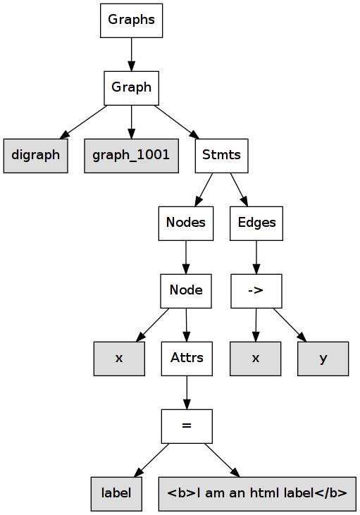

# Dot Tools - Parser for Graphviz's Dot Language

by Tim Henderson (tim.tadh@gmail.com)

This module provides a parser for the dot langauge. You can use it to produce an
AST of a `*.dot` file. It deals correctly with the language as specified on in
the [graphviz documentation](http://www.graphviz.org/doc/info/lang.html). If you
find it cannot parse your `dot` file open an issue and let me know.

Example:

    from dot_tools import parse

    tree = parse('digraph { x [label=<<b>I am an html label</b>>] x -> y }')
    print tree

Output (a pre-order enumeration of the tree, deserialize with `betterast`)

    1:Graphs
    3:Graph
    0:digraph
    0:graph_1001
    2:Stmts
    1:Nodes
    2:Node
    0:x
    1:Attrs
    2:=
    0:label
    0:<b>I am an html label</b>
    1:Edges
    2:->
    0:x
    0:y

It also supports visualizing the AST as dot:

    print tree.dotty()

Output (after running it through graphviz)

Finally, you can use the built-in "SimpleGraph" to load the nodes and edges in a
graph. Note, this format does not support all the features of the dot language
(for instance, subgraphs, attributes other than label, etc...).

    from dot_tools.dot_graph import SimpleGraph

    g = SimpleGraph.build(tree.kid('Graph'))
    print g.nodes
    print g.edges

Output

    {'y': 'y', 'x': '<b>I am an html label</b>'}
    [('x', 'y', '')]

